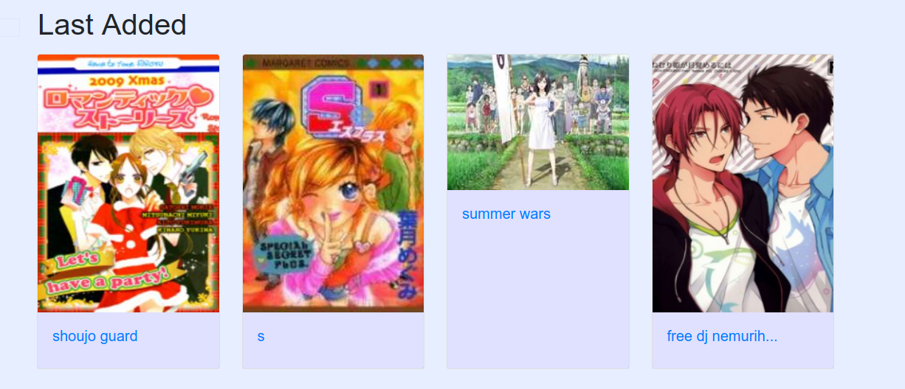

# sercopiDownload

Las especificaciones técnicas: Herramientas, estructuración, Base de Datos, funcionamiento interno y enlaces de interés o referencias, se encuentran en un archivo de documentación añadido con el proyecto. Ésta, en cambio, será una guía de uso práctico e instalación del mismo.

### Table of contents

<ul>
<li><a href="#docker">Creación del Docker</a></li>
<li><a href="#despliegue">Despliegue de la Aplicación</a></li>
<li><a href="#scrap">Uso de los Scripts de Scrapping</a></li>
<li><a href="#use">Uso de la aplicación</a>
<ul>
<li><a href="#login">Login</a></li>
<li><a href="#index">Index</a></li>
<li><a href="#busquedaSencilla">Búsqueda Sencilla</a></li>
<li><a href="#recurso">Vista de Recurso</a></li>
<li><a href="#descarga">Descarga</a></li>
<li><a href="#comentarios">Comentarios</a></li>
<li><a href="#busquedaAvanzada">Búsqueda Avanzada</a></li>
<li><a href="#follows">Follows</a></li>
<li><a href="#history">History</a></li>
</ul>
</li>
<li><a href="#toimplement">To Implement</a></li>
<li><a href="#reflexiones">Reflexiones</a></li>
<li><a href="#otrosProyectos">Otros Proyectos</a></li>

</ul>

### Creación del Docker

Una vez abastecida la BD podemos comenzar nuestra aplicación.

Para ello creamos el docker con la imagen necesaria con:

`docker run -i -t -p "80:80" -v ${PWD}/app:/app -v ${PWD}/mysql:/var/lib/mysql mattrayner/lamp:latest`

siendo las rutas a la izquierda, las rutas a las carpetas donde se va a alojar nuestro código (descargado de github) y nuestros archivos de BD. respectivamente. El puerto, puede cambiarse en nuestra máquina cambiando el de la izquierda.

### Despliegue de la aplicación

Una vez hecho ésto, nos metemos en el docker con:

`docker exec -it (nombre del docker) /bin/bash`

y estaremos dentro del mismo:

Lo siguiente es crear el usuario de MYSQL con los permisos necesarios, que vamos a usar en nuestra aplicación. La imagen viene con phpmyadmin, o puede hacerse a través de línea de comandos.

Una vez conseguido, y abriendo otra terminal, clonamos el repositorio de github desde nuestra máquina principal, directamente en la carpeta que mapeamos anteriormente, en nuestro caso, _app_. A continuación volvemos a la terminal de docker, nos dirigimos a _app/sercopiDownload_ (la carpeta que crea github) y lanzamos:

`composer install`

Este comando instalará todas las dependcias necesarias, Laravel 7 y las librerías necesarias.

Al terminar, tenemos que crear el archivo .env tal y como indica el archivo .env.example que se incluye en la raíz del proyecto:

`cp .env.example .env`

y completarlo con los datos de nuestra base de datos, así como los datos de mailing que vamos a usar para enviar los emails, en nuestro caso:

<pre>
MAIL_MAILER=smtp
MAIL_HOST=smtp.googlemail.com
MAIL_PORT=465
MAIL_USERNAME=un email
MAIL_PASSWORD=su contraseña
MAIL_ENCRYPTION=ssl
MAIL_FROM_ADDRESS=null
MAIL_FROM_NAME="\${APP_NAME}"
</pre>

_Nota: No olvidar habilitar el uso de aplicaciones de terceros en la cuenta._

Además tenemos que generar una Key, que se usará para cifrar la conexión, para ello, en la terminal de docker lanzamos:

`php artisan key:generate`

Y obtendremos la key en nuestro .env

Una vez hecho esto nuestra aplicación está casi lista para lanzarse. Se sirve por un servidor apache, desde _/var/www_, que está mapeado dentro del docker a la carpeta _/app_ de la raíz, que contiene nuestro código.

Pero antes de lanzarla, debemos de obtener los recursos para que los usuarios puedan interaccionar con ellos.

### Uso de los scripts de Scrapping

Para usar los scripts de scrapping y comenzar a rellenar la BD, primero habrá que crear una BD en MySQL con el nombre deseado, crear un usuario con los permisos para crear y borrar contenido y una contraseña. Todo esto deberá ser luego escrito en un archivo _.env_ tal y como especifica el del ejemplo.

Los scripts se encuentran en la ruta: _App/Services/scripts_, con lo que tendremos que situarnos en la misma. Una vez ahí, lanzamos el comando:

`php executeScripts.php tipo(manga/novel) variables`

Para empezar, y comprobar el funcionamiento, las variables pueden ser: _manga (nombre del manga)_ para obtener por consola la informaciónd e un solo manga. Igual con las novelas. Una vez comprobado que funciona,
procedemos a lanzar los siguientes comandos:

`php executeScripts.php manga genres`

para rellenar la BD con todos los géneros de manga

`php executeScripts.php manga all`

para comenzar a scrappear y añadir a la BD. Los erroes individuales se muestran en consola o se deshechan.

El script compara el contenido de la BD y añade sólo si hay alguna diferencia, con lo que al estar vacía, tardará varias horas. El resultado:

Obtención de la info de todos los mangas...
 

Obtención de los capítulos de cada manga, si hay capítulos nuevos ó descarga de un manga completo si es totalmente nuevo...
 

Las novelas tardan bastante más debido a una protección recientemente añadida a la página, y a menudo no consiguen descargarse enteras antes de que se corte la conexión por completo durante un tiempo. (se están explorando alternativas)

el código sería:

`php executeScripts.php novel genres`

`php executeScripts.php novel all`

y el feedback es prácticamente el mismo.

### Uso de la aplicación

#### Acceder al login y registrarse/logearse

Para entrar, lanzamos: `ifconfig` En la terminal de docker para obtener nuestra ip local, y nos dirigimos al navegador a:

_http://(la ip obtenida)/sercopiDownload/public_

Nos encontramos con las vistas de _Login/Registro_:

Creamos un usuario con un correo válido al que tengamos acceso real. En nuestro caso, mi correo personal: sergiiosercopi@gmial.com de nombre: admin (al que le hemos dado el rol de admin desde la BD)

#### index

Accedemos de esta manera a la vista principal, en la que encontramos:

_Menú de Navegación_, que nos seguirá toda la aplicación:

En él podremos hacer una búsqueda sencilla por nombre, o acceder al resto de vistas o a nuestro perfil (a implementar) para modificarlo o hacer logout.

En la página de inicio también encontraremos:

_Carrousel_ de los mangas más pupulares, éstos son, los que han recibido más interacciones por los usuarios en los últimos 4 días.

Al pasar el ratón por los laterales aparecerán los controles y podremos clickar para navegar por el carrousel, o clickar una carta para navegar hasta la vista del manga.

_Últimos capítulos añadidos_ en los mangas y novelas que seguimos.

Si presionamos en el botón, nos llevará a la página de cada uno. Se encuentran paginados por el menú de paginación que se repetirá en toda la aplicación. el menú muestra siempre la página actual y 5 páginas más por delante o por detrás. En caso de que haya más, muestra "...". Podemos usar los botones o clickar directamente en los números para navegar por las páginas.

Otro _carrousel_ con los últimos mangas añadidos.

#### Búsqueda sencilla

Si realizamos una búsqueda sencilla, obtendremos todos los resultados de nombre similar:

Ésta sería la vista a la que nos guiaría la búsqueda del término "dragon", la vista contiene los resultados paginados de mangas y novelas por separado, a razón de 30 por página.

Los Contenedores son colapsables, por si queremos obviar el resultado de mangas o novelas.

Podemos elegir ver la sinopsis del recurso, clickando en "Show Synopsis" ó ir a la vista del recurso clickando en "Ir".

#### Vista de un recurso

La vista de los recursos sigue la misma lógica para ambos, en el caso de los mangas:

Se muestra la imagen e información del recurso. Se puede interaccionar con el mismo clickando en la votación de estrellas (en este caso se le dió un 5). La votación se realiza siempre en números enteros, de 1 a 5, ambos incluidos.

En este caso, se está siguiendo al recurso, lo que quiere decir que aparecerá en nuestra vista de _follows_ y que obtendremos información de él en nuestra página de inicio si se obtuvieran más capítulos del mismo.

Como se explica en la documentación, las notificaciones todavía están por implementar. Sin embargo, la lógica en la vista se encuentra funcional:

Si activamos las notificaciones, se activa el follow si no se encontraba activado. De la misma manera, desactivar el follow, desactiva las notificaciones, pero no al revés.

#### Descarga

Lo siguiente que encontramos es la sección de capítulos:

Se pueden seleccionar capítulos de cada version clickando en el select del mismo, o todos los capítulos de una version clickando en el select de arriba. En este caso:

Al hacer click en DownloadSelection, se lanza el job que descargará nuestro capítulo y enviará el email en segundo plano, mientras tanto el usuario recive el feedback para continuar navegando:

La descarga es recibida tan pronto como se realice el job. Los trabajos son despachados y escritos en una tabla específica de la BD. Para comenzar a procesarlos, es necesario escribir, en la carpeta de nuestro proyecto:

`php artisan queue:work`

De manera que los trabajos comienzan a ejecutarse en el momento que queramos, en el ejemplo se muestra un trabajo fallido (con un error a propósito en el código) y uno exitoso:

Al completarse, el usuario habrá recibido el correo:

Al hacer click, descargará el recurso directamente desde el servidor. Para que nos funcione, tenemos primero que especificar la url de nuestra aplicación en nuestro .env como APP*URL=\_http://(la ip obtenida)/sercopiDownload/public*

_Nota: Más adelante, en entornos de producción, aquí iría nuestro dominio personal._

Los jobs que han tenido un fallo, se escriben en la tabla _failed_jobs_ de nuestra BD. Y el feedback se encuentra en _storage/logs/laravel.log_ por defecto, aunque puede programarse y cambiarse.

Por detrás, las descargas se guardan en la carpeta:
_public/users_ en laque se crea una carpeta con el ID del usuario, donde se guarda el producto, que tiene el nombre del recurso y un timestamp:

_Nota: se ha dejado así por comodidad, pero la carpeta public, es la única a la que el usuario debería poder acceder directamente, sin embargo, no es la que debería de almacenar el producto, sino que la carpeta users debería convertirse en un enlace simbólico a una carpeta en la carpeta storage(que es donde se recomienda guardar todo) ó a cualquier otra carpeta de nuestra elección en el entorno de producción._

#### Comentarios

Volviendo a la vista del recurso, encontramos la sección de los comentarios:

Ésta sección también está hecha tratando de imitar el comportamiento de una SPA. De manera que con Javascript, cada petición o comentario es procesado al margen de la vista principal y se obtiene una vista renderizada de la sección, con el cambio (comentario añadido, borrado, etc...) que se reinserta tras borrar la anterior.

De esta manera el usuario puede:

Crear un comentario nuevo:

Modificar un comentario suyo ya existente:

Responder a un comentario ya existente:

Las respuestas se guardan en una subsección, y referencian siempre el comentario padre (por el nombre del autor).

Los comentarios se referencian por su ID en la base de datos.

Además, el usuario puede interaccionar con los comentarios dándoles un Like o un dislike.

#### Búsqueda avanzada

Volviendo al menú de navegación, podemos clickar en _Advanced Search_, obteniendo la vista:

Aquí podemos seleccionar o introducir parámetros para realizar una búsqueda de un recurso mucho más acotada y certera.

En el caso de los géneros, se puede seleccionar el género una vez para pedir que esté incluido en los resultados (verde), ó una segunda vez para especificar que no queremos los resultados con dicho género(rojo):

Los resultados, de nuevo, se insertan por una petición que renderiza una vista parcial, que luego es introducida, para no cambiar la vista principal e imitar el comportamiento de una SPA.

Se encuentran paginados y podemos navegar entre ellos, u ordenarlos por los criterios de arriba:

#### follows

Si continuamos por el menú de navegación, podemos acceder a la vista de _follows_:

Aquí se muestran todos los recursos que estamos siguiendo, y podemos cambiar nuestro rating, follow, notificaciones, o acceder al recurso en cuestión.

#### History

En la vista de _History_:

Podemos acceder a un historial de las intearcciones que tuvimos con todos los recursos, desde búsquedas hasta descargas.

Si clickamos en la descarga, nos especifica:

### To implement

Cambios que hacer en un futuro, para añadir calidad al código, o cosas que mejorar:

<ul>
<li style="list-style-type:square">Extraer la lógica de Eloquent e interacciones con la BD de los controladores a Servicios en la carpeta Servicios.</li>
<li style="list-style-type:square">Mejorar los scripts de scrapping, para hacerlos más rápidos y que manejen errores, usando python con alguna librería específica.</li>
<li style="list-style-type:square">Añadir una parte de perfil de usuario, donde el usuario pueda al menos cambiar su foto o su contraseña.</li>
<li style="list-style-type:square">Añadir una parte de estadísticas, donde se muestren gráficas que enseñen como cambia la popularidad de un recurso o su rating con el tiempo (motivo por el que se implementaron las tablas <i>recurso_rating_history</i> y <i>recurso_update_history</i>)</li>
<li style="list-style-type:square">Mejorar el sistema de errores.</li>
<li style="list-style-type:square">convertir la aplicación en una aplicación REST, no usar Blade para el frontend y usar un framwerk como VUE, que permita mejorar la calidad en el cliente</li>
</ul>

### Reflexiones

Laravel es un framework muy completo y potente, y que tiene una comunidad muy activa, que ha generado módulos muy útiles para realizar aplicaciones de gestión o de compras, o incluso un debugger (debugbar). No dudaría en usarlo en el futuro. Aunque quizá como backend exclusivo, puesto que el motor de plantillas Blade, aunque potente y robusto, no da lugar a obtener una aplicación realmente moderna, como se obtendría con un framewerk como VUE,React o Angular. que permite realizar trabajos más potentes y reactivos en el cliente, que usando vanilla javascript, requerirían demasiado tiempo y esfuerzo.

Sin embargo, Eloquent es definitivamente muy útil y potente para preparar el backend, puesto que permite escribir menos código, normalizarlo y reusarlo.

La documentación para crear los archivos Migrations es un poco excasa, y ejemplos más complejos no se encuentran recogidos, con lo que mis archivos migrations no generan de manera perfecta la BD necesaria, puesto que algunas soluciones tuve que aplicarlas a mano sobre la BD por carecer de los conocimientos necesarios.

### Otros Proyectos

He desarrollado en todo este tiempo proyectos en vista a mejorar lo anteriormente mencionado en el apartado To Implement, scripts de python para web Scrapping, proyectos serverless hosteados en heroku y github, usando VUE (Vuetify, Vuex, VueRouter, etc...) y firebase y he recreado algunas vistas usando una implementación de graphQL en VUE (Apollo) y Laravel (lighthouse).

-Proyecto usando Vue-Vuetify y firebase (autentificación y base de datos)[<a href="https://github.com/sercopi/vuex-vuetify-calendar">github</a>][<a href="https://sercopi-agenda.herokuapp.com/#/">heroku</a>]

-Proyecto graphQL usando Laravel(lighthouse) como servidor graphQL y Vue(Apollo) como cliente graphQL[<a href="https://github.com/sercopi/BackendSercopiQL">github(backend)</a>][<a href="https://github.com/sercopi/frontendsercopiql">github(frontend)</a>]
